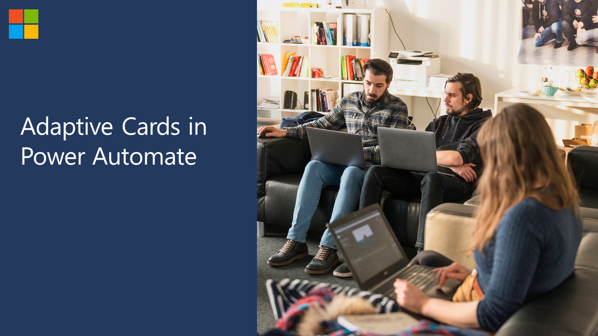
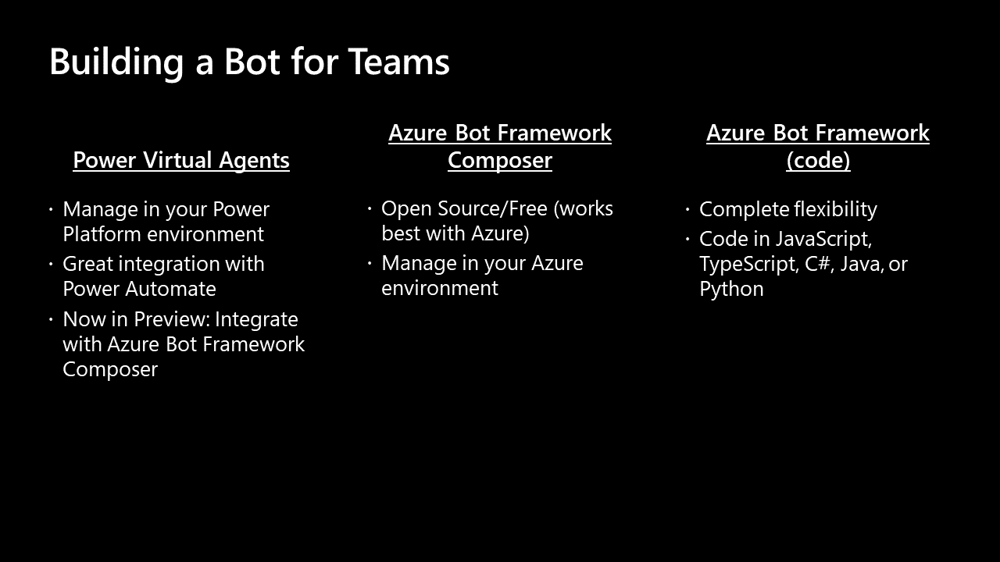

# Building Applications for Microsoft Teams

## PART 1

## What is Teams? What is a Teams app?

## Building Apps with SharePoint

## Building Apps with Power Apps

## Adaptive Cards with Power Automate

## Building an App with Graph Toolkit

## Webhooks and Connectors

## Building Bots

