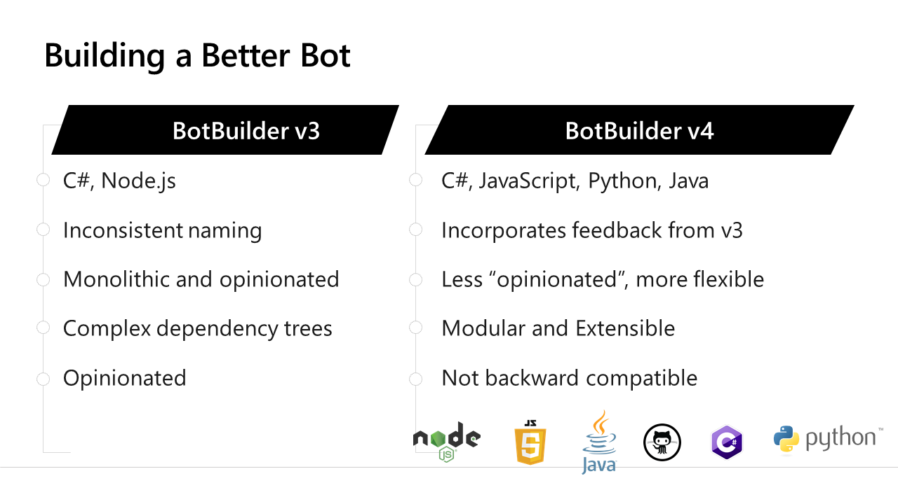

# Building Applications for Microsoft Teams

## Part 2 - Deeper Dive and Developer Solutions

| Time | Topics |
|-----|-----|
| 12:30 - 1:45 | Review, Hello World, SharePoint Framework |
| 1:45 - 2:00 | break |
| 2:00 - 3:15 | Bots, Adaptive Cards, Messaging Extensions |
| 3:15 - 3:30 | break |
| 3:30 - 4:30 | Calling Microsoft Graph from your Teams app |

## Review: Teams Apps and App Manifest

* [Teams developer documentation](https://aka.ms/TeamsDevDocumentation)
* [Teams developer samples](http://aka.ms/TeamsSampleBrowser)
* [Hands-on labs](https://aka.ms/LearnTeamsDev)
* [App Templates](http://aka.ms/TeamsAppTemplates)
* [Teams App Design guidance](http://bit.ly/Design4Teams)

## Hello, World: Creating your project

* [Teams App Studio](https://aka.ms/InstallTeamsAppStudio)
* [Yo Teams](https://docs.microsoft.com/en-us/microsoftteams/platform/tutorials/get-started-yeoman)
* [Teams Toolkit for VS Code and Visual Studio](https://aka.ms/TeamsToolkitVS)

## Tabs with SharePoint Framework

* [Global Developer Bootcamp 1: Building Teams Apps with SharePoint](https://aka.ms/Bootcamp1Lab)
* [Teams Tabs in SharePoint Framework Tutorial](http://bit.ly/TeamsSPFx)
* [Field visit tab sample](https://aka.ms/360DegreeCollab)

## Bots with Azure Bot Framework

* [QnA Maker](https://www.qnamaker.ai/)
* [Bot Builder Quickstart](http://bit.ly/AzBotBuilder)
* [LUIS (Language Understanding Intelligent Service](https://www.luis.ai/)
* [Consulting bot sample](https://aka.ms/ConsultingBotSample)

## Adaptive Cards deeper dive

* [Adaptive Cards](ttps://adaptivecards.io/)

## Messaging Extensions

* [What are Messaging Extensions](https://docs.microsoft.com/en-us/microsoftteams/platform/messaging-extensions/what-are-messaging-extensions)
* [Build a Messaging Extension](https://docs.microsoft.com/en-us/microsoftteams/platform/build-your-first-app/build-messaging-extension)
* [Building Messaging Extensions with SPFx](https://docs.microsoft.com/en-us/sharepoint/dev/spfx/build-for-teams-expose-webparts-teams)

## Calling the Microsoft Graph

* [OData Reference](https://bit.ly/ODataSpec)
* [Microsoft Graph Explorer](https://bit.ly/GraphExplorer)
* [MS Graph Postman Collection](https://bit.ly/GraphPostman)
* [Azure AD Postman Collection](https://bit.ly/AadPostman)
* [Calling Graph from Microsoft Teams(4-part article series)](http://aka.ms/CallingGraphFromTeams)
* [Teams Pop-up w/MSAL Calls Graph sample](https://aka.ms/CallGraphTeamsTab-MSAL)
* [Teams SSO tab calls Graph sample](https://aka.ms/CallGraphTeamsTab-SSO)
* [Teams SPFx tab calls Graph sample](https://aka.ms/CallGraphTeamsTab-SPFx)
* [Teams Bot calls Graph sample](https://aka.ms/CallGraphTeamsBot-AuthDialog)
