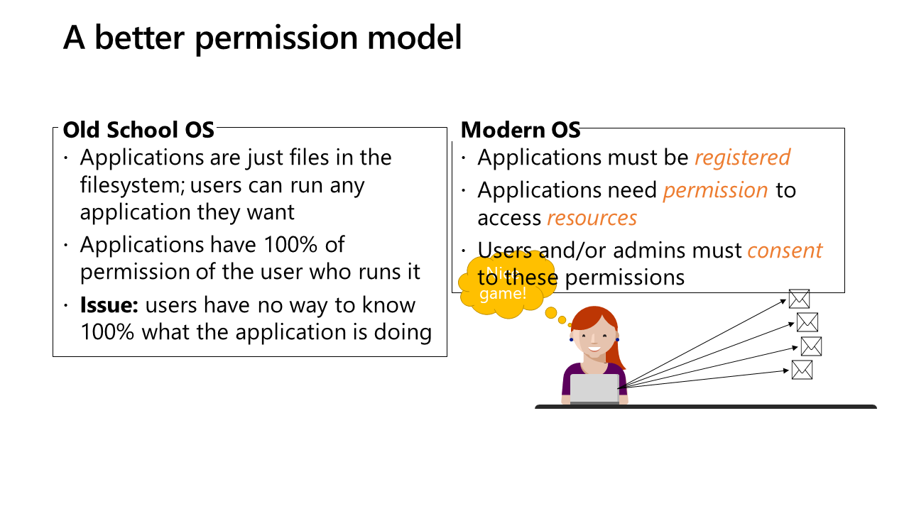

# Building Applications for Microsoft Teams

## Part 2 - Deeper Dive and Developer Solutions

### Approximate Schedule

| Time | Topics |
|-----|-----|
| 12:30 - 1:45 | Review, Hello World, SharePoint Framework |
| 1:45 - 2:00 | break |
| 2:00 - 3:15 | Bots, Adaptive Cards, Messaging Extensions |
| 3:15 - 3:30 | break |
| 3:30 - 4:30 | Calling Microsoft Graph from your Teams app |

## Slides and Notes

Welcome to Building Applications for Microsoft Teams - Deeper Dive and Developer Solutions. This half-day workshop is for anyone who wants to learn how to build applications for Microsoft Teams. It's all about how Teams apps work, backed up with low-code examples. Tomorrow's workshop builds on this one, and goes into the coding aspects of Teams development.

These notes include all the slides and links to relevant resources. You may find it helpful to follow along during the workshop!

## Review: Teams Apps and App Manifest

Microsoft Teams is a brilliant façade over all of Microsoft 365. All of the M365 services are unified into a single user interface in Teams.

A Teams application does not run _in_ _Teams_, it only appears to. Each application is hosted somewhere on the Internet - for example a tab is just a web page, and a bot is a web service. The app package you install into Teams is just a zip file containing a file called manifest.json that tells Teams where these web pages and services are.

The best apps are those that integrate not only with the Teams UI but also with the rest of Microsoft 365. For example, an app that is aware of the user's calendar, or which file a user just edited, can save a lot of steps for the user. The API to access these services is the Microsoft Graph.

There are many options for extending Teams - you don't necessarily need to write code! This workshop will focus mainly on the Low-Code options; tomorrow will focus on Custom development.

[App Templates](http://aka.ms/TeamsAppTemplates) are pre-written apps that are open source; some are low-code (such as Power Apps) and some are coded solutions that need to be installed in Azure. You can use them as-is or as a starting point for building something new.

Teams apps can run in any of 3 scopes:
 * Teams: App appears in a Teams channel
 * Group Conversation: App appears in a group chat
 * Personal: App appears in the left sidebar or under the "..." for use by individual users

 Some app features work only in specific scopes. For example, a Personal (Static) tab only works in Personal scope; a Configurable tab can run only in Teams or Group Conversations scope. Also Connectors can only work in a Teams channel.

### More helpful links:
* [Teams developer documentation](https://aka.ms/TeamsDevDocumentation)
* [Teams developer samples](http://aka.ms/TeamsSampleBrowser)
* [Hands-on labs (in TypeScript)](https://aka.ms/LearnTeamsDev)
* [Teams App Design guidance](http://bit.ly/Design4Teams)

## Hello, World: Creating your project

* [Yo Teams](https://docs.microsoft.com/en-us/microsoftteams/platform/tutorials/get-started-yeoman)
* [Teams Toolkit for VS Code and Visual Studio](https://aka.ms/TeamsToolkitVS)

* [Teams App Studio](https://aka.ms/InstallTeamsAppStudio) - Manifest editor runs right in Teams

## Tabs with SharePoint Framework

* [Overview of the SharePoint Framework](https://docs.microsoft.com/en-us/sharepoint/dev/spfx/sharepoint-framework-overview)

* [Teams Tabs in SharePoint Framework Tutorial](http://bit.ly/TeamsSPFx)
* [Global Developer Bootcamp 1: Building Teams Apps with SharePoint](https://aka.ms/Bootcamp1Lab)
* [Field visit tab sample](https://aka.ms/360DegreeCollab)

## Bots with Azure Bot Framework

* [Azure Bot Framework](https://dev.botframework.com/)
* [Bot Framework SDK - v3 vs. v4](https://docs.microsoft.com/en-us/azure/bot-service/migration/migration-about)

If you want to see the generated code without running the generator, there's a copy [here](https://github.com/BobGerman/Bots/tree/master/Templates)

If you want to see the generated code without running the generator, there's a copy [here](https://github.com/BobGerman/Bots/tree/master/Templates

* [Azure Bot Framework Emulator](https://docs.microsoft.com/en-us/azure/bot-service/bot-service-debug-emulator)
* [ngrok](https://ngrok.com/)
* [Azure remote debugging](https://docs.microsoft.com/en-us/visualstudio/azure/vs-azure-tools-debug-cloud-services-virtual-machines)

* [Setting SSL for local tab debugging](https://bob1german.com/2020/10/17/setting-up-ssl-for-tabs-in-the-teams-toolkit-for-visual-studio-code/)

* [State Bot](https://github.com/BobGerman/Bots/tree/master/StateBot)

* [Bot Dialogs documentation](https://docs.microsoft.com/en-us/azure/bot-service/bot-builder-concept-dialog?view=azure-bot-service-4.0)

* [LUIS (Language Understanding Intelligent Service](https://www.luis.ai/)

More Bot Links

* [Bob's Bot Workshop at last year's SPFest!](https://github.com/BobGerman/Bots)
* [QnA Maker](https://www.qnamaker.ai/)
* [Bot Builder Quickstart](http://bit.ly/AzBotBuilder)
* [Consulting bot sample](https://aka.ms/ConsultingBotSample)

## Adaptive Cards deeper dive

* [Adaptive Cards](ttps://adaptivecards.io/)

## Messaging Extensions

* [What are Messaging Extensions](https://docs.microsoft.com/en-us/microsoftteams/platform/messaging-extensions/what-are-messaging-extensions)

* [Build a Messaging Extension](https://docs.microsoft.com/en-us/microsoftteams/platform/build-your-first-app/build-messaging-extension)
* [Building Messaging Extensions with SPFx](https://docs.microsoft.com/en-us/sharepoint/dev/spfx/build-for-teams-expose-webparts-teams)
* [Northwind customers sample](https://github.com/pnp/teams-dev-samples/tree/master/samples/msgext-customer-search)
* [HTTP Status Cats](https://knowyourmeme.com/memes/http-status-cats)
* [HTTP Status Cats messaging extension](https://github.com/pnp/teams-dev-samples/tree/master/samples/msgext-httpstatuscats)

## Calling the Microsoft Graph

* [Microsoft Graph Explorer](https://bit.ly/GraphExplorer)
* [MS Graph Postman Collection](https://bit.ly/GraphPostman)
* [Azure AD Postman Collection](https://bit.ly/AadPostman)

* [Teams SSO tab calls Graph sample](https://aka.ms/CallGraphTeamsTab-SSO)

* [Teams SPFx tab calls Graph sample](https://aka.ms/CallGraphTeamsTab-SPFx)

* [Teams Pop-up w/MSAL Calls Graph sample](https://aka.ms/CallGraphTeamsTab-MSAL)

* [Teams Bot calls Graph sample](https://aka.ms/CallGraphTeamsBot-AuthDialog)

More links:

* [Calling Graph from Microsoft Teams(4-part article series)](http://aka.ms/CallingGraphFromTeams)

* [OData Reference](https://bit.ly/ODataSpec)
